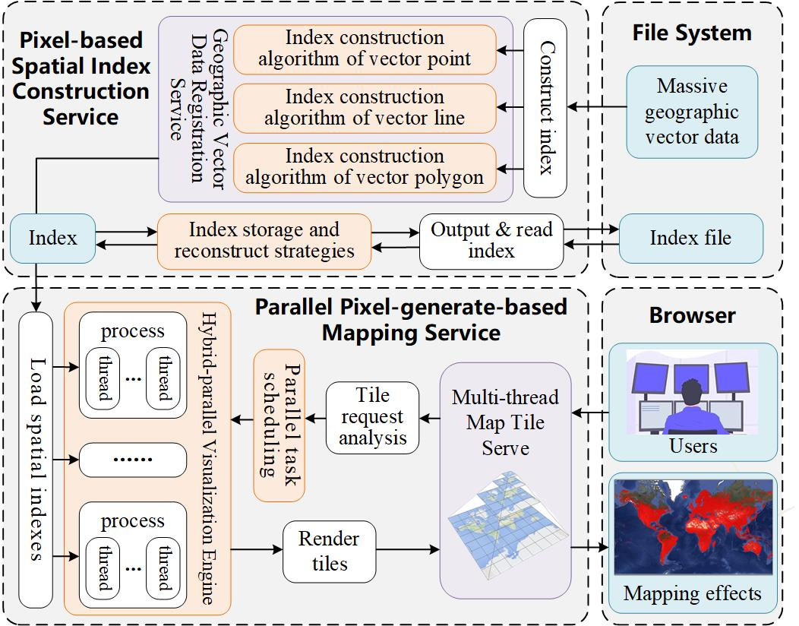
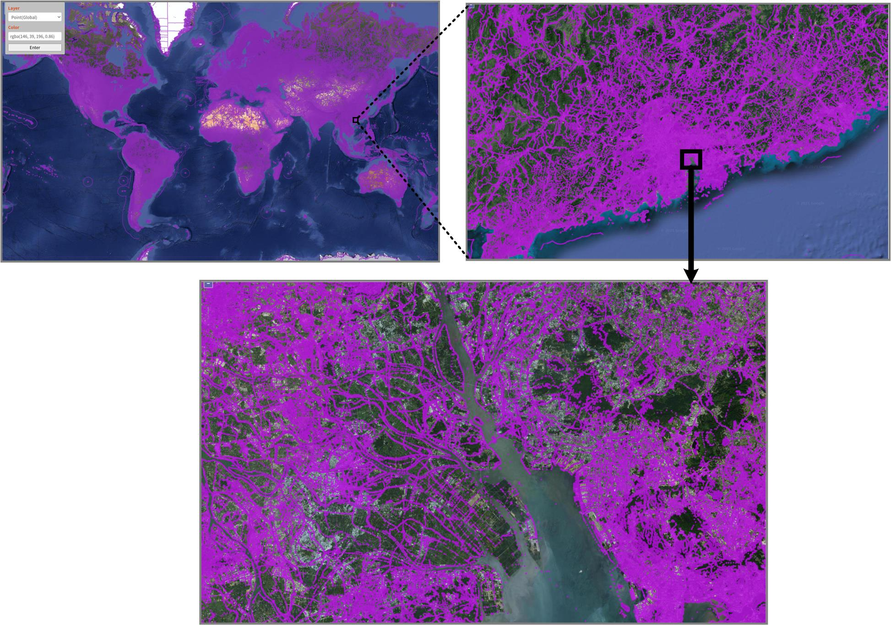
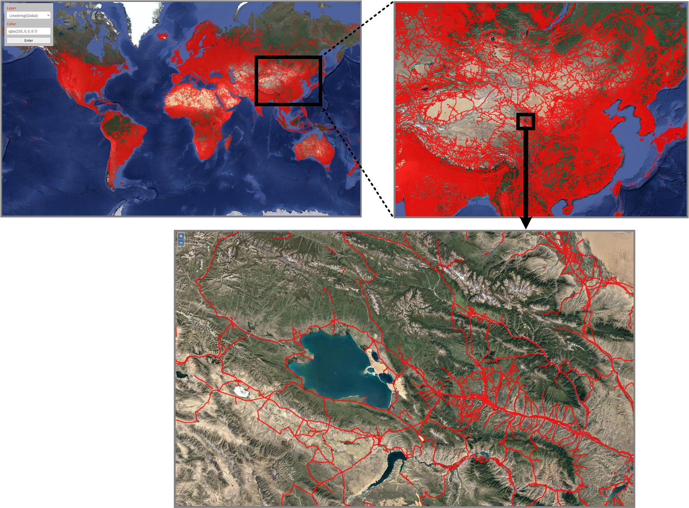
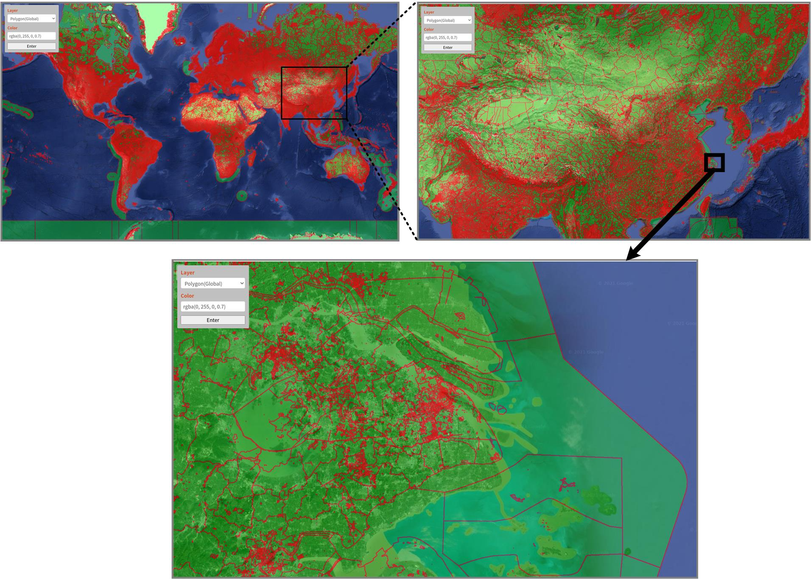

# HiVecMap

## 1. Introduction

HiVecMap is an efficient and real-time map visualization software tool for massive geographic vector data mapping, which provides users a interactive way to perform data organization and visualization on large-scale geographic vector data and reduces the memory overhead by loading the constructed spatial index file instead of the original dataset. In HiVecMap, the vector data including point, linestring and polygon features are rasterized and the map tile technology is used, therefore, the general high-resolution cartographic preview effect can display in the screen quickly after constructing the VPQ spatial index of a given dataset and calculating the specific pixel value of the screen. Additionally, while traditional GIS softwares are difficult to display tens of millions of geographic vector data, HivecMap can realize real-time interactive browsing of geographic vector data of a billion scales.


*ffig1. Architecture of HiVecMap*

## 2. Software Settings

### 2.1. Environment

*Tab1. SoftWare environment*
| Item             | Type                                              |
|------------------|---------------------------------------------------|
| CPU              | 32 core, Inter(R) Xeon(R) CPU E5-2620 V4 @ 2.1Ghz |
| Memory           | 512 GB                                            | 
| Operating System | Ubuntu 18.04                                      |
### 2.2. Presentation Data

*Tab2. SoftWare datasets: point features, roads, polygon features of OSM (100-million-scale)*
| Name                        | Type       | Records       | Data Size     |
|-----------------------------|------------|---------------|---------------|
| OSM global point faetures   | Point      | 2,682,401,763 | 2,682,401,763 |
| OSM global roads            | LineString | 106,268,554   | 1,573,469,984 |
| OSM global polygon features | Polygon    | 181,772,692   | 2,077,524,465 |


## 3. Software Dependencies
### 3.1. C++
* [Redis]() ( recommended version 3.2.12 )
> ~~~
> wget http://download.redis.io/releases/redis-3.2.12.tar.gz
> tar -zxvf redis-3.2.12.tar.gz
> cd redis-3.2.12
> make && make install
> ~~~

* [hiredis](https://github.com/redis/hiredis) ( recommended version 1.0.0 )
> ~~~
> wget https://github.com/redis/hiredis/archive/v1.0.0.zip
> unzip hiredis-v1.0.0.zip
> cd hiredis-1.0.0
> make && make install
> ~~~

* [boost](https://www.boost.org/) ( recommended version 1.72.0 )
> ~~~
> wget https://sourceforge.net/projects/boost/files/boost/1.72.0/boost_1_72_0.tar.gz
> tar -zxvf boost_1_72_0.tar.gz
> cd boost_1_72_0
> ./bootstrap.sh --prefix=/usr/local
> ./b2 install --with=all
> ~~~

* [MPICH](https://www.mpich.org/) ( recommended version 3.3.2 )
> ~~~
> wget http://www.mpich.org/static/downloads/3.3.2/mpich-3.3.2.tar.gz
> tar -zxvf mpich-3.3.2.tar.gz
> cd mpich-3.3.2
> ./configure --disable-fortran 
> make && make install
> ~~~

* [zlib](http://www.zlib.net/) ( recommended version 1.2.11 )
> ~~~
> wget http://www.zlib.net/zlib-1.2.11.tar.gz
> tar -zxvf zlib-1.2.11.tar.gz
> cd zlib-1.2.11
> ./configure
> make && make install
> ~~~
  
* [libpng](http://www.libpng.org/pub/png//libpng.html) ( recommended version 1.2.59 )
> ~~~
> wget https://sourceforge.net/projects/libpng/files/libpng12/1.2.59/libpng-1.2.59.tar.gz
> tar -zxvf libpng-1.2.59.tar.gz
> cd libpng-1.2.59
> ./configure
> make && make install
> ~~~

* [Hicore](https://gitee.com/CoreSpatial/core-open) ( closed-source )

    header files and binary files are provided in "./dep_package/Hicore", moving "hicore" to "./HiVecMap_code/include" and moving and "libhigis.a" and "libhigis.so" to "./HiVecMap_code/bin" separately.


### 3.2. Python

* [Flask](https://flask.palletsprojects.com/en/2.0.x/) ( recommended version 2.0.3 )
> ~~~
> pip install -U Flask -i http://pypi.douban.com/simple/
> ~~~

### 3.3. JavaScripts

* [openLayers](https://openlayers.org/) ( recommended version 6.13.0 )
> ~~~
> npm install ol
> ~~~

## 4. Operating Steps

### 4.1. Compile

all the source codes are included in **HiVecMap_code**. Run the following command to generate the executable programs:
> ~~~
> cd HiVecMap_code    # Go to source directory
> mkdir build         # Create a build directory
> cd build            # Move into build directory
> cmake ..            # Configure for your system
> make                # Generate the executable programs
> cd ..               # Move back to source directory
> ~~~

### 4.2. Construction of VPQ Spatial Index
> ```shell
> sh ./buildIndex.sh
> ```

Edit the following parameters in "buildIndex.sh"

* shp_fileName: path of the input shapefiles (default: "./data/china_point")
* shp_name: specific shapefile name, if there are multiple shapefiles, separate them with '|' (default: "china_point.shp")
* output_path: path to output the indexs (default: "./output/")

### 4.3. Visualization of Vector Data
> ~~~
> sh ./plotting.sh
> ~~~

Edit the following parameters in "plotting.sh"
* point_indexName:   index name of vector point data，fill in null if no need to visualize (default: china_mainland_poi)
* line_indexName:    index name of vector lineString data，fill in null if no need to visualize (default: china_mainland_road)
* polygon_indexName: index name of vector polygon data，fill in null if no need to visualize (default: china_mainland_province)
* output_path:       path to output the indexs (default: "./output/")
* process:           MPI process count (default: 1)
* redishost:         host IP of Redis (default: 127.0.0.1)
* redisPort:         host port of Redis (default: 6379)

Input http://localhost:8888/HiVecMap in the browser after the following info printed in "./plotting.log
"
> ~~~
> <<<<<<<<<<<<<<     read point index: china_mainland_poi successfully    >>>>>>>>>>>>>>
> <<<<<<<<<<<<<<     read line index: china_mainland_road successfully    >>>>>>>>>>>>>>
> <<<<<<<<<<<<<< read polygon index: china_mainland_province successfully >>>>>>>>>>>>>>
> ~~~

### 4.4. Stop Software automatically
> ~~~
> sh ./stop.sh
> ~~~

## 5. Examples

 HiVecMap implements real-time visualization of 100-million-scale geographic vector features, additionally, interactive browsing and exploration of geographic vector data can be realized by changing color, transparency and other styles in HiVecMap. The interface of the software is simple to use, choose a dataset, transparency, alpha and click the Enter button. Fig2-4 show the mapping effcts of geographic vecotr point, lineString and polygon data.

* mapping effects of geographic vector point data
  

*Fig2. OSM global point faetures*

* mapping effects of geographic vector lineString data
  

*Fig3. OSM global roads*

* mapping effects of geographic vector polygon data
  

*Fig4. OSM global polygon features*

## Contact

* Institution   
Zebang Liu @ National University of Defense Technology     
Luo Chen @ National University of Defense Technology   
Mengyu Ma @ National University of Defense Technology   
Anran Yang @ National University of Defense Technology

* Email    
liuzebang19@nudt.edu.cn    
luochen@nudt.edu.cn   
mamengyu10@nudt.edu.cn    
yanganran@nudt.edu.cn

* Tel  
+8613142350585       
+8613975801542   
+8615507487344   
+8615711316876